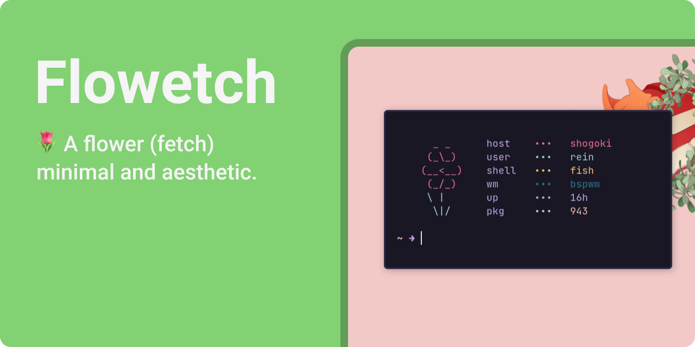

<p style="margin: -20px 0 30px">
  <a href="https://www.buymeacoffee.com/migueravila" target="_blank" style='margin-right:0px; margin-top:5px'>
    
  </a>
</p>

## 👇 Index
- [👇 Index](#-index)
- [⚙️ Installation](#️-installation)
- [🎨 Customization](#-customization)
  - [📦 Packages](#-packages)
  - [🖼️ Art](#️-art)

## ⚙️ Installation

1. Clone this repo with `git clone https://github.com/migueravila/Flowetch.git`
2. Run `cd Flowetch`
3. Run `sudo make install`
4. Now you can run it with `flowetch` 

## 🎨 Customization

This fetch Is thought to be used as a personal fetch and have your own fork of it (That's why It doesn't work for all distros or have a lot of ASCII art)

### 📦 Packages

- The fetch is already configured for Arch Based distros: `pacman -Qq | wc -l`
- If you're on Debian based distros use: `dpkg -l | wc -l`
- If you're on a Fedora based distro use: `rpm -qa | wc -l`

### 🖼️ Art

```shell
ARTR1="${c1}     _ _    "
ARTR2="${c1}    (_\_)   "
ARTR3="${c1}   (__<__)  "
ARTR4="${c1}    (_/_)   "
ARTR5="${c2}    \ |     "
ARTR6="${c2}     \|/    "
```